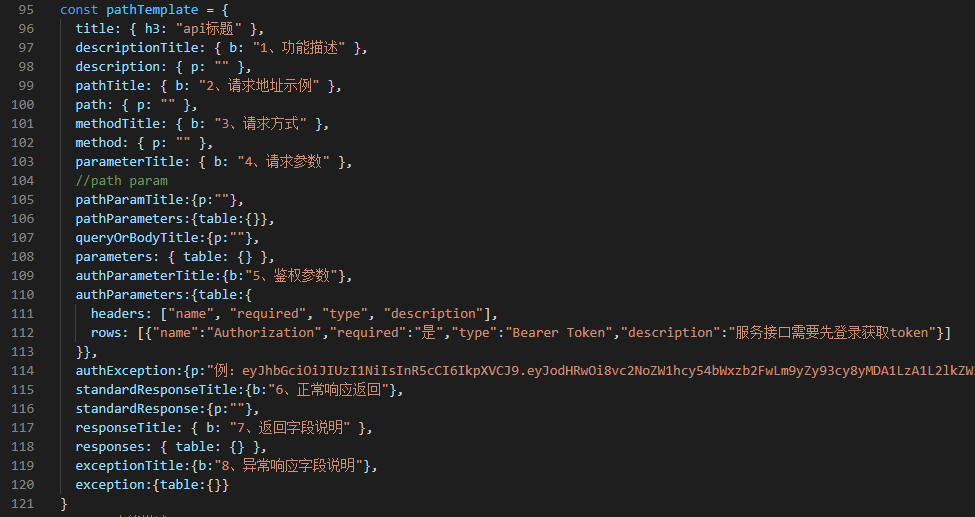

# yapi-api-document-auto-generator

### 使用说明

1 因修改过原node module, 下载后请不要更新node 包；

2 请下载yapi的swaggerjson数据；

3 header.md文件为不包含在swaggerjson中的项目说明部分，需要自己写。代码只负责生成json中的接口文档；

4 json2md.js为代码主体部分。pathTemplate是需要生成的格式部分，必要时可修改；

5 生成后的格式见文件pensees-cloud-api.md

# 五、通行功能模块相关API

## 自助录入-P1

### 管理员端-导出

**1、功能描述**

管理员端-导出

**2、请求地址示例**

/tenant/selfHelp/export

**3、请求方式**

get

**4、请求参数**

Query:

| name          | required | type   | description |
| ------------- | -------- | ------ | ----------- |
| personType    | 否       | string |             |
| key           | 否       | string |             |
| deptId        | 否       | string |             |
| reviewStatus  | 否       | string |             |
| needReviewing | 否       | string |             |
| startDate     | 否       | string |             |
| endDate       | 否       | string |             |
| source        | 否       | string |             |

**5、鉴权参数**

| name          | required | type         | description                 |
| ------------- | -------- | ------------ | --------------------------- |
| Authorization | 是       | Bearer Token | 服务接口需要先登录获取token |

例：eyJhbGciOiJIUzI1NiIsInR5cCI6IkpXVCJ9.eyJodHRwOi8vc2NoZW1hcy54bWxzb2FwLm9yZy93cy8yMDA1LzA1L2lkZW50aXR5L2NsYWltcy9uYW1laWRlbnRpZmllciI6IjEiLCJodHRwOi8vc2NoZW1hcy54bWxzb2FwLm9yZy93cy8yMDA1LzA1L2lkZW50aXR5L2NsYWltcy9uYW1lIjoiYWRtaW4iLCJBc3BOZXQuSWRlbnRpdHkuU2VjdXJpdHlTdGFtcCI6ImIyM2QyYmZjLTVmMWMtYWFlZC04YzNkLTM5ZjU0OTQxMmY4OCIsImh0dHA6Ly9zY2hlbWFzLm1pY3Jvc29mdC5jb20vd3MvMjAwOC8wNi9pZGVudGl0eS9jbGFpbXMvcm9sZSI6IkFkbWluIiwic3ViIjoiMSIsImp0aSI6IjY0MmY0ODc1LWQ0YTAtNDQ3Zi1iNzgwLTQzMDYxMzIwOTU5NSIsImlhdCI6MTU5Mjg3OTk5NiwidGVuYW50SWQiOiJudWxsIiwibmJmIjoxNTkyODc5OTk2LCJleHAiOjE1OTI5NjYzOTYsImlzcyI6Im5xdm9rdTlpR3BZYWEwYnJ0ZFJlSnJVZUF0eVVjSE8zIiwiYXVkIjoiQ2hhcm9uIn0.QJN4QAzjkz4MVy9_cdz3vggbcMkQjhLMEk9BYKnhNos

**6、正常响应返回**

{

    "msg": "success",

    "code": 0,

    "data": {

        "name": "9a15ff9a-5d7e-4d66-adb9-cec87826a83e.xlsx",

        "id": "9a15ff9a-5d7e-4d66-adb9-cec87826a83e",

        "url": "/tenant/common/retrieveFile/1/9a15ff9a-5d7e-4d66-adb9-cec87826a83e",

        "suffix": ".xlsx",

        "pathName": "D:\export",

        "msg": null,

        "count": 2,

        "percentage": -1.0

    }

}

**7、返回字段说明**

| name                     | type   | description |
| ------------------------ | ------ | ----------- |
| msg                      | string |             |
| code                     | number |             |
| data                     | object |             |
| &ensp;&ensp;--name       | string | 姓名        |
| &ensp;&ensp;--id         | string | ID          |
| &ensp;&ensp;--url        | string |             |
| &ensp;&ensp;--suffix     | string |             |
| &ensp;&ensp;--pathName   | string |             |
| &ensp;&ensp;--msg        | null   |             |
| &ensp;&ensp;--count      | number |             |
| &ensp;&ensp;--percentage | number |             |

**8、异常响应字段说明**